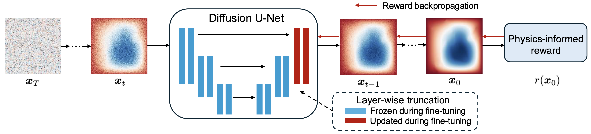

# PIRF: Physics-Informed Reward Fine-Tuning for Diffusion Models

This is the official PyTorch implementation for **PIRF: Physics-Informed Reward Fine-Tuning for Diffusion Models** (NeurIPS 2025 AI4Science workshop).


This repository builds upon [DiffusionPDE](https://github.com/jhhuangchloe/DiffusionPDE) and [EDM](https://github.com/NVlabs/edm). We thank the authors for their contributions.

## Requirements

Python libraries: see [`environment.yml`](environment.yml) for dependencies. Create the conda environment with:
```bash
conda env create -f environment.yml -n PIRF
conda activate PIRF
```

## Datasets & base models

For fair comparison, we use the training datasets from [DiffusionPDE](https://github.com/jhhuangchloe/DiffusionPDE) and [PG-Diffusion](https://github.com/BaratiLab/Diffusion-based-Fluid-Super-resolution). Please prepare training datasets for:
- Burgers' equation
- Darcy flow
- inhomogeneous Helmholtz equation
- Poisson equation
(all above from [DiffusionPDE](https://github.com/jhhuangchloe/DiffusionPDE))
- Kolmogorov flow
(from [PG-Diffusion](https://github.com/BaratiLab/Diffusion-based-Fluid-Super-resolution)).

For base models, we use existing pretrained models when available. You can download pretrained models for Burgers' equation, Darcy flow, inhomogeneous Helmholtz equation, and Poisson equation from [DiffusionPDE](https://github.com/jhhuangchloe/DiffusionPDE).

For Kolmogorov flow, since the original codebase is not based on EDM, we retrained the model using EDM's official configurations to obtain the base model. Our training script is derived from [EDM](https://github.com/NVlabs/edm). To train a new diffusion model on the joint distribution, e.g.,
```bash
# Prepare data format
python baselines/merge_kol.py

# Train the diffusion model
torchrun --standalone --nproc_per_node=3 train.py \
  --outdir=pretrained-kolmogorov \
  --data=/data/Kolmogorov/ \
  --cond=0 --arch=ddpmpp \
  --batch=60 --batch-gpu=20 \
  --tick=10 --snap=50 --dump=100 \
  --duration=20 --ema=0.05
```

## PIRF fine-tuning & evaluation

After preparing the dataset and base model, start PIRF fine-tuning toward the physics-informed reward:
```bash
# Fine-tune PIRF on Darcy flow
torchrun --standalone --nproc_per_node=2 finetune_pirf.py \
    --outdir=output/darcy \
    --data=training/darcy_merged \
    --resume=pretrained-models/pretrained-darcy.pkl \
    --reward-fn=darcy \
    --cond=0 \
    --arch=ddpmpp \
    --batch=40 \
    --snap=20 \
    --tick=1 \
    --dump=20 \
    --duration=6 \
    --ema=0.05 \
    --augment=0 \
    --fp16=True \
    --seed=42 \
    --draft-method=DRaFT-K \
    --k=2 \
    --num-steps=20 \
    --lr=1e-4 \
    --weight-regularization=0
```

After obtaining the fine-tuned model, evaluate it with:
```bash
# Evaluate PIRF
python evaluate_pirf.py --data_name darcy
```

## Baselines

We provide reimplementations of baselines in `baselines/` for a unified comparison.

- For guidance-based methods ([DiffusionPDE](https://github.com/jhhuangchloe/DiffusionPDE) and [CoCoGen](https://epubs.siam.org/doi/abs/10.1137/24M1636071)), no fine-tuning or retraining is required; you can directly generate results using the base model. Note that due to implementation differences, small accuracy differences may occur.
```bash
# DiffusionPDE
python baselines/evaluate_diffusionpde.py --data_name darcy

# CoCoGen
python baselines/evaluate_cocogen.py --data_name darcy
```

- For [PIDM](https://github.com/jhbastek/PhysicsInformedDiffusionModels) and [PG-Diffusion](https://github.com/BaratiLab/Diffusion-based-Fluid-Super-resolution), use the training scripts. For example, train PIDM on Burgers' equation:
```bash
torchrun --standalone --nproc_per_node=2 train_pidm.py \
    --outdir=output/burgers \
    --data=preprocessed_data/burgers \
    --resume=pretrained-models/pretrained-burgers.pkl \
    --reward-fn=burgers \
    --cond=0 \
    --arch=ddpmpp \
    --batch=128 \
    --snap=20 \
    --tick=1 \
    --dump=20 \
    --duration=6 \
    --ema=0.05 \
    --augment=0 \
    --fp16=True \
    --seed=42 \
    --mode=mean \
    --reward-loss-scaling=1e-4 \
    --lr=1e-4 \
    --cache=False
```

## Start with your own dataset or PDE

1. Prepare sufficient training data via simulation or traditional solvers, formatted as EDM expects. Ensure inputs are normalized to (-1, 1).
2. Train a base model using appropriate [EDM](https://github.com/NVlabs/edm) configurations.
3. Design the reward function for your PDE and place it under `reward/`. Double-check whether your reward expects normalized or unnormalized data.
4. Fine-tune via PIRF. As a starting point, use backpropagation steps `k=1` or `k=2`. Empirically, `k=1` works well with `num-steps=80`, and `k=2` works well with `num-steps=20` (this can depend on the PDE).
5. Evaluate performance using the provided evaluation scripts. Remember to denormalize generated outputs back to the original range.

## Acknowledgements

Our code is licensed under the MIT License. The `dnnlib`, `torch_utils`, `training` folders, and `train.py` are derived from the [EDM codebase](https://github.com/NVlabs/edm) by Tero Karras, Miika Aittala, Timo Aila, and Samuli Laine, originally shared under the [Attribution-NonCommercial-ShareAlike 4.0 International License](https://github.com/NVlabs/edm/blob/main/LICENSE.txt). Some functions in `reward/` and evaluation scripts are derived from [DiffusionPDE](https://github.com/jhhuangchloe/DiffusionPDE) and [PG-Diffusion](https://github.com/BaratiLab/Diffusion-based-Fluid-Super-resolution). We appreciate their contributions.

Our work is greatly inspired by [DRaFT](https://arxiv.org/abs/2309.17400), [DiffusionPDE](https://github.com/jhhuangchloe/DiffusionPDE), and [EDM](https://github.com/NVlabs/edm).

## Citation

```bibtex
@misc{yuan2025pirf,
      title={PIRF: Physics-Informed Reward Fine-Tuning for Diffusion Models}, 
      author={Mingze Yuan and Pengfei Jin and Na Li and Quanzheng Li},
      year={2025},
      eprint={TBD},
      archivePrefix={arXiv},
      primaryClass={cs.LG},
      url={TBD}
}
```